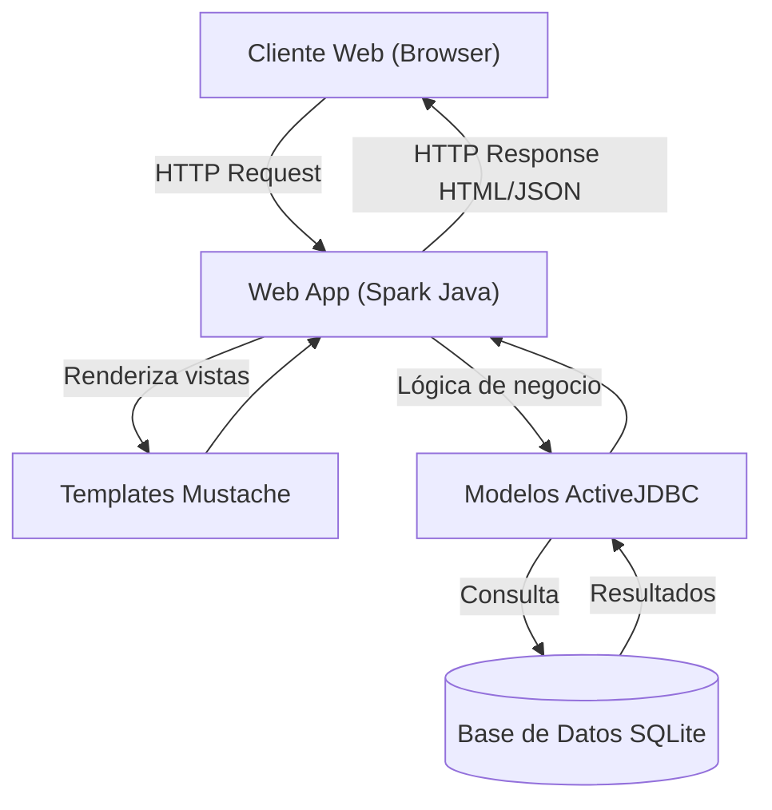
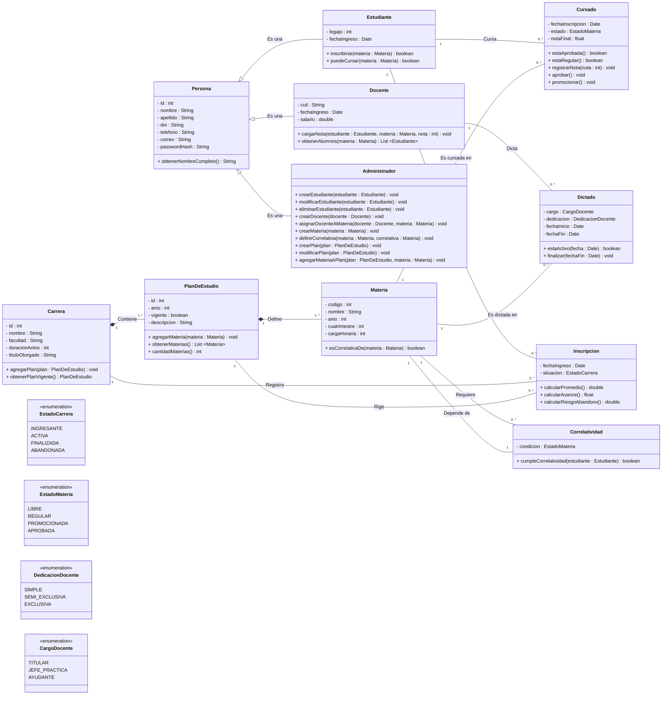

**Ingeniería de Software II (Cód. 3387) - Año 2026**  
**AGÜERO, Daniel Ignacio - GASTALDI, Martín - GUZMAN, Ayelen - PEREYRA, Jorge Pedro Ezequiel - VEGA, Matías Thomas**

# **Proyecto Integrador - Administración Académica Universitaria - Especificación, Gestión y Planificación**

## **1. DESCRIPCIÓN DEL PROYECTO**

### **- Problema que se quiere resolver**
En la actualidad, muchas universidades aún cuentan con **sistemas poco eficientes para realizar su gestión académica**. En algunos casos, la información se encuentra distribuida en múltiples sistemas fragmentados y poco seguros, o incluso siguen haciendo uso de procesos manuales lentos, problemáticos y poco escalables.  

Esta situación genera, entre otras cosas:

- Dificultad para acceder a información actualizada en tiempo real.
- Errores en la carga de datos.
- Inconsistencia en la información.

El proyecto busca solucionar estas problemáticas y propone desarrollar un **sistema centralizado, el cual permita mejorar la administración académica y el acceso a la información de una manera sencilla, ágil y segura**.

### **- Usuarios del sistema**
- **Administrador / Personal de oficina**
  - Gestiona estudiantes, docentes, materias y planes de estudio.
  - Tiene permisos de edición y control total sobre la información.

- **Estudiantes**
  - Consultan su información personal, notas y avance en la carrera.
  - Se inscriben en materias si cumplen correlatividades.

- **Docentes**
  - Cargan notas de los estudiantes.
  - Consultan listados de alumnos en sus materias.
  - Se les asigna cargo (jefe de cátedra, jefe de trabajos prácticos, ayudante).

### **- Funcionalidades principales**
1. **Gestión de estudiantes**
   - Alta, baja, modificación y consulta de datos personales.
   - Inscripción a materias validando correlatividades.
   - Visualización del estado en la carrera y avance en el plan.

2. **Gestión de docentes**
   - Alta, baja y modificación de datos.
   - Asignación de materias y cargos.
   - Acceso a listados de alumnos y carga de notas.

3. **Gestión de materias**
   - Alta, baja y modificación de materias.
   - Definición de correlatividades.
   - Asociación con planes de estudio.
   - Acceso de docentes para cargar notas.

4. **Gestión de planes de estudio**
   - Creación, edición y consulta de planes por carrera.
   - Definición de materias, carga horaria, año/cuatrimestre y correlatividades.

5. **Gestión de correlatividades**
   - Validación automática de inscripciones según materias aprobadas.
   - Mostrar correlativas al consultar estudiantes.

### **- Restricciones técnicas**

El sistema deberá:

- Ser accesible mediante cualquier **navegador web**.
- Implementar mecanismos de **autenticación** y **control de acceso** según el rol del usuario (administrador, estudiante, docente).
- Garantizar la **seguridad** y **confidencialidad** de los datos académicos.
- Utilizar una **base de datos relacional** para el almacenamiento de la información.
- Ser **compatible** con la infraestructura tecnológica disponible.
- Brindar una **alta disponibilidad** del sistema (24/7), sujeta a tareas de mantenimiento programadas.
- Garantizar la **integridad de los datos**, evitando inconsistencias en operaciones concurrentes.
- Permitir la **escalabilidad**, de modo que pueda soportar un aumento en la cantidad de usuarios sin degradar significativamente su rendimiento.
- Mantener **tiempos de respuesta aceptables** para operaciones críticas.
- Implementar mecanismos de **respaldo y recuperación de datos** ante fallos.

### **- Tamaño del equipo**
El desarrollo del proyecto está a cargo de un equipo conformado por **5 integrantes**.
Se trata de una cantidad adecuada para la complejidad del proyecto propuesto, ya que permite repartir las tareas de manera organizada y equitativa. Además, facilita la comunicación entre los miembros y permite la adaptación en caso de posibles cambios en el transcurso del proyecto.

### **- Tecnologías elegidas y justificación**

Para el desarrollo se utilizan tecnologías que permiten trabajar de forma más simple, organizada y eficiente.

Las herramientas utilizadas son:
- **Java**: utilizado como lenguaje principal.
- **Spark Java**: microframework que facilita la creación del servidor web de manera sencilla.
- **SQLite**: base de datos liviana que no requiere configuraciones complejas.
- **ActiveJDBC**: permite trabajar con objetos Java en lugar de escribir SQL manualmente.
- **Mustache**: plantillas utilizadas para generar las vistas del sistema.
- **Apache Maven**: ayuda en la gestión del proyecto, la compilación y el empaquetado.

Estas tecnologías fueron elegidas porque permiten **desarrollar el sistema sin agregar complejidad innecesaria**, facilitando el trabajo para el equipo. Además, **se integran fácilmente entre sí simplificando el desarrollo** y mantenimiento del sistema.

### **- Plazo estimado total**
- **Duración aproximada:** 8–12 semanas (2 a 3 meses).
- **Metodología sugerida:** Desarrollo incremental con entregables por fase.

### **- Cambios de alcance ocurridos**

El alcance del proyecto fue evolucionando progresivamente, organizándose en distintas fases de desarrollo que incorporan nuevas funcionalidades.

***Fase 1: Fundamentos (2–3 semanas)***  

- **Objetivo:** Construir la base del sistema.

  - Diseñar la base de datos inicial (estudiantes, docentes, materias).
  - Implementar CRUD básico (crear, leer, actualizar, eliminar).
  - Crear interfaz inicial para administradores.
  - Configurar roles y permisos básicos.

- **Entregable:**

  - Sistema mínimo funcional con gestión de estudiantes y docentes.

***Fase 2: Expansión (3–4 semanas)***  

- **Objetivo:** Ampliar funcionalidades y validar inscripciones.

  - Implementar gestión de planes de estudio.
  - Incorporar validación automática de correlatividades.
  - Interfaces diferenciadas para estudiantes y docentes.
  - Funcionalidad de inscripción a materias con validaciones.

- **Entregable:**

  - Sistema con planes de estudio y validación de inscripciones.

***Fase 3: Funcionalidades avanzadas (4–6 semanas)***  

- **Objetivo:** Completar el sistema con herramientas de seguimiento y escalabilidad.
  - Implementar cálculo de riesgo de abandono de estudiantes.
  - Reportes académicos y seguimiento de avance.
  - Optimización de permisos y seguridad.
  - Pruebas de integración y despliegue.

- **Entregable:**

  - Sistema académico completo, listo para pruebas finales y uso institucional.

### **- Problemas encontrados**

Durante el desarrollo del proyecto se identificaron los siguientes problemas:

- **Falta de separación en capas**, concentrando toda la lógica en una única clase principal.
- **Manejo manual de conexiones a la base de datos**, con posibles impactos en rendimiento.
- **Inconsistencias en la seguridad** (uso de contraseñas en texto plano en algunos endpoints).
- **Validaciones de datos limitadas**.
- **Problemas de rendimiento** por consultas repetidas a la base de datos.
- **Falta de revisiones formales** de código.

### **- Forma de organización del equipo**

La organización del flujo de trabajo del equipo es la siguiente:

- **Asignación de tareas**

  Se asignan las tareas vía telefónica y se registran como issues en GitHub con fecha de entrega y criterios de aceptación. Para ello, se utilizará la metodología ágil SCRUM.

- **Trabajo en la rama main**

  Todos los miembros trabajan directamente en la rama `main`, actualizando frecuentemente su copia local.

- **Commits**

  Se realizan commits frecuentes y descriptivos para cada cambio realizado, evitando commits grandes que incluyan múltiples cambios no relacionados.

- **Sincronización**

  Antes de cada sesión, se realiza un `git pull origin main` y después de cada sesión, se realiza un `git push origin main`.

- **Documentación**

  Un miembro asignado actualiza la documentación en GitHub (README.md u otros archivos), para evitar errores y tener una estructura prolija.

- **Revisión de código**

  El código es revisado de manera informal entre los miembros antes de ser integrado a la rama `main`.

- **Pruebas**

  Cada miembro realiza pruebas locales antes de hacer un commit y se realizan pruebas generales al final de cada fase del proyecto.

- **Entrega y plazos**

  El equipo se asegura de cumplir con las fechas estipuladas y realiza una prueba de integración final antes de la entrega.

- **Distribución Backend-Frontend**

  En principio, no se establecerá una división entre los integrantes del grupo respecto a quién trabajará en el Backend y quién lo hará en el Frontend, sino que las tareas se designarán por comodidad de cada uno.

## **2. ANÁLISIS DE RIESGOS**

A continuación, se registran y clasifican los riesgos detectados para el proyecto.

| TIPO DE RIESGO | DESCRIPCIÓN | PROBABILIDAD | IMPACTO | IDENTIFICADO POR |
|:--------------:|:-----------:|:------------:|:-------:|:----------------:|
| Técnico | Arquitectura monolítica improvisada sin separación en capas | Alta | Alto | Equipo / IA (ChatGPT - Copilot - Gemini) |
| Técnico | Uso de SQLite (poco escalable) en sistema multiusuario concurrente | Alta | Alto | Equipo / IA (ChatGPT - Copilot - Gemini) |
| Técnico | Vulnerabilidad de seguridad por contraseñas en texto plano | Alta | Alto | Equipo / IA (ChatGPT - Copilot - Gemini) |
| Técnico | Validaciones de datos insuficientes | Alta | Alto | Equipo / IA (ChatGPT - Copilot) |
| Técnico | Falta de pruebas automatizadas | Alta | Alto | IA (ChatGPT - Copilot) |
| Técnico | Servicios necesarios intermitentes o faltantes | Alta | Alto | Equipo |
| Técnico | Problemas de rendimiento por consultas repetidas | Media | Alto | Equipo / IA (ChatGPT - Copilot - Gemini) |
| Técnico | Alta disponibilidad sin infraestructura definida | Media | Alto | IA (ChatGPT) |
| Técnico | Escalabilidad no validada | Media | Alto | IA (ChatGPT) |
| Técnico | Dificultad en el modelado de las correlatividades entre materias | Media | Alto | Equipo |
| Técnico | Solicitud y manejo complejo de condicionalidades de materias | Media | Alto | Equipo |
| Técnico | Complejidad algorítmica para el cálculo de riesgo de abandono de estudiantes | Media | Alto | Equipo |
| Técnico | Falla en las herramientas de trabajo del equipo | Media | Alto | Equipo |
| Técnico | Integración de tecnologías sin experiencia | Media | Medio | IA (ChatGPT) |
| Organizacional | Trabajo directo sobre rama main | Alta | Alto | Equipo / IA (ChatGPT - Copilot - Gemini) |
| Organizacional | Falta de revisiones formales de código | Alta | Alto | Equipo / IA (ChatGPT - Copilot) |
| Organizacional | Brecha entre requisitos y tecnología | Media | Alta | IA (Gemini) |
| Organizacional | Asignación informal de tareas | Media | Medio | Equipo / IA (ChatGPT - Copilot) |
| Organizacional | Un solo responsable de documentación | Media | Medio | IA (ChatGPT - Copilot) |
| Organizacional | Falta de roles claros | Media | Medio | IA (ChatGPT - Copilot - Gemini) |
| Organizacional | Uso superficial de SCRUM | Media | Medio | IA (ChatGPT) |
| Organizacional | Falta de seguimiento de avances | Media | Medio | Equipo |
| Organizacional | Desorganización en el uso del repositorio (GitHub) | Media | Medio | Equipo |
| Organizacional | Falta de compromiso por alguna de las partes | Baja | Alto | Equipo |
| Organizacional | Mala comunicación en el grupo | Baja | Alto | Equipo |
| Organizacional | Pérdida de algún integrante del equipo | Baja | Medio | Equipo |
| Planificación | Plazo muy ajustado (8 - 12 semanas) | Alta | Alto | IA (ChatGPT - Copilot) |
| Planificación | Subestimación de funcionalidades complejas | Alta | Alto | Equipo / IA (ChatGPT - Gemini) |
| Planificación | Pruebas sólo al final de cada fase | Alta | Alto | Equipo / IA (ChatGPT - Copilot) |
| Planificación | No considerar tiempo para refactorización | Alta | Medio | IA (ChatGPT - Gemini) |
| Planificación | Requerimientos mal definidos o incompletos | Media | Alto | Equipo |
| Planificación | Mala priorización de tareas en el backlog | Media | Alto | Equipo |
| Planificación | Falta de planificación de despliegue e infraestructura | Media | Alto | IA (ChatGPT) |
| Planificación | Equipo pequeño ante posibles imprevistos | Media | Alto | IA (Copilot) |
| Planificación | Falta de hitos intermedios claros | Media | Medio | IA (Gemini) |
| Planificación | Dependencia de muchas tareas a una funcionalidad clave | Media | Medio | Equipo |
| Planificación | Subestimación del tiempo de corrección de errores | Media | Medio | Equipo |
| Humano | Falta de experiencia en seguridad | Alta | Alto | Equipo / IA (ChatGPT) |
| Humano | Fallo en el aseguramiento de calidad | Alta | Alto | IA (Gemini) |
| Humano | Dependencia de comunicación informal | Alta | Medio | IA (ChatGPT - Copilot) |
| Humano | Posible sobrecarga de un miembro | Media | Alto | Equipo / IA (Copilot) |
| Humano | Motivación variable en un proyecto académico | Media | Alto | Equipo / IA (Copilot) |
| Humano | Conocimiento desigual de tecnologías por parte de los integrantes | Media | Medio | IA (ChatGPT) |
| Humano | Ausencia de especialización | Media | Medio | IA (ChatGPT - Copilot - Gemini) |
| Humano | Fatiga por plazos ajustados | Media | Medio | Equipo / IA (ChatGPT) |
| Humano | Posibles conflictos grupales o descoordinación | Media | Medio | IA (Copilot) |
| Humano | Dificultad para adaptarse a cambios y avances del proyecto | Media | Medio | Equipo |
| Humano | Exceso de confianza en la delegación de tareas a herramientas de IA | Media | Medio | Equipo |
| Humano | Falta de iniciativa o baja constancia por parte de algún miembro | Media | Medio | Equipo |
| Humano | Dificultad para pedir ayuda a tiempo | Media | Medio | Equipo |
| Humano | Problemas personales o imprevistos de un integrante | Baja | Alto | Equipo |
| Humano | Pérdida de conocimiento por mala documentación y comunicación | Baja | Medio | IA (Gemini) |

La identificación de riesgos muestra diferencias entre los aportes del equipo y los de las herramientas de LLM. Por un lado, **la IA tiende a proponer riesgos más generales y basados en buenas prácticas de ingeniería de software**, especialmente en aspectos técnicos como arquitectura, seguridad, testing y escalabilidad. Por otro lado, **el equipo identifica riesgos más concretos y vinculados a su forma real de trabajo**, incluyendo problemas de organización, comunicación y factores humanos.

En cuanto al nivel de detalle, **los riesgos del equipo resultan más contextualizados y realistas**, mientras que **los de la IA aportan una visión más teórica y estructurada**. Ambos enfoques se complementan, logrando una cobertura más completa y de mayor calidad de los distintos tipos de riesgo.

En conclusión, la combinación de ambas perspectivas permite obtener un **análisis más sólido, equilibrado y representativo** de la realidad del proyecto.

## **3. DISEÑO DEL SISTEMA**

### **3.1 Arquitectura general**

El siguiente diagrama representa una vista general de la **arquitectura del sistema**, mostrando los principales **componentes** y el **flujo de interacción** entre el cliente web, el servidor backend y la base de datos. Esta representación permite comprender cómo se procesan las **solicitudes HTTP**, cómo se **gestionan los datos** y cómo se generan las **respuestas hacia el usuario**.

### **3.2 Modelo de dominio**

El siguiente **Diagrama de Clases** representa el **modelo de dominio del sistema** de administración académica. En él se describen las principales **entidades** del sistema, sus **atributos**, **métodos** y **relaciones**, permitiendo visualizar la **estructura general** del software y su **organización interna**.

